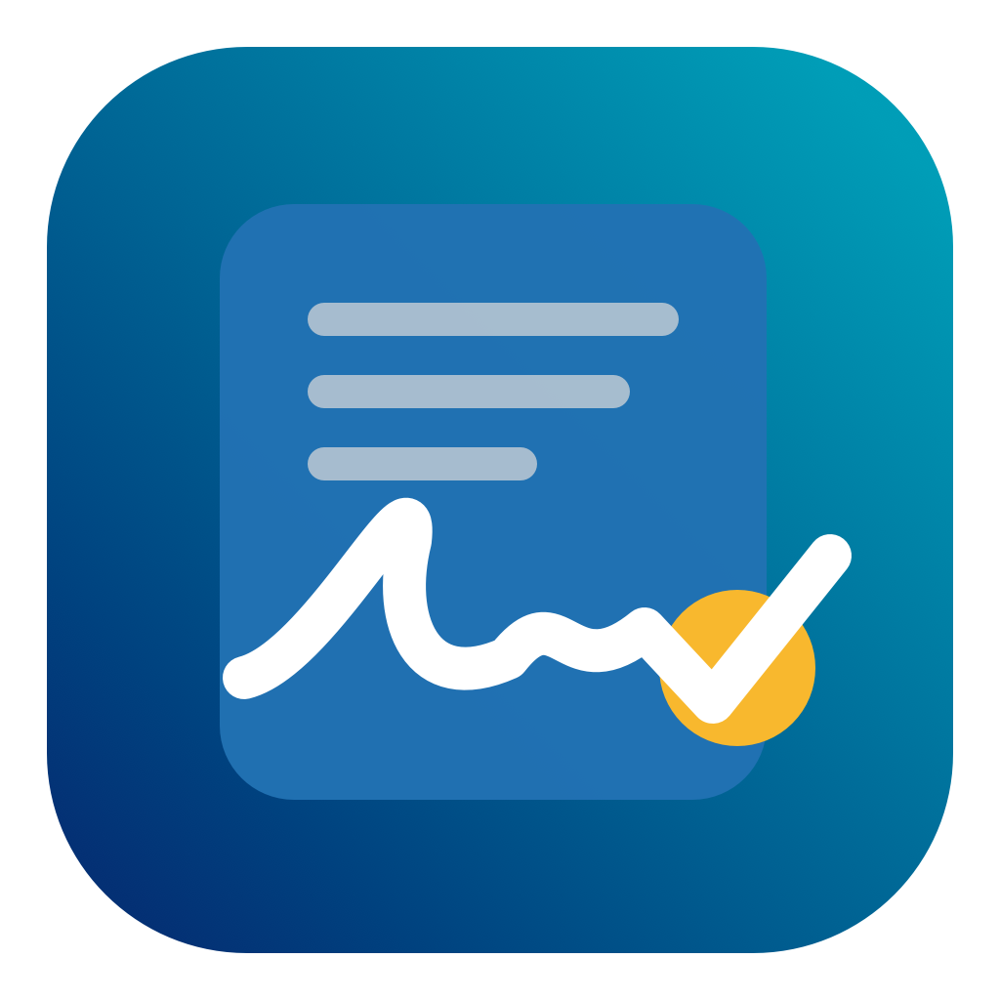

# CaseCloser



CaseCloser turns a MacBook trackpad into a temporary absolute-position signature pad. The entire physical trackpad maps directly to the on-screen rectangle you select, so a client can imagine that rectangle on the trackpad and sign without watching the pointer. It works with applications that accept ordinary mouse-drag input, including browser signature fields and PDF/form software.

## Download

[Download the latest macOS release](https://github.com/pohmervin/CaseCloser/releases/latest)

CaseCloser requires macOS 14 or later and supports both Apple silicon and Intel Macs. The downloadable build is ad-hoc signed rather than Apple-notarized, so on first launch you may need to Control-click the app, choose **Open**, then confirm **Open**.

## Privacy

- Stroke points exist only in memory while Signature Mode is active.
- The app does not save signatures or make network requests.
- Strokes are discarded when Signature Mode ends or the app quits.
- It uses public AppKit touch APIs and Quartz mouse events.

## Build

This project requires macOS 14 or later and the Swift toolchain included with Apple Command Line Tools.

```sh
chmod +x scripts/build-app.sh
./scripts/build-app.sh
```

The application is created at `dist/CaseCloser.app`.

To create the distributable zip:

```sh
./scripts/package-release.sh
```

## Use

1. Open the webpage, PDF, or application containing the signature box.
2. Open CaseCloser and select **Select Signature Area…**.
3. Drag a rectangle around the signature box.
4. Imagine that the whole trackpad is the selected rectangle, then sign with one finger. Contact starts a stroke and lifting ends it; no click is required.
5. Check the memory-only preview, then press **Return**. CaseCloser brings the selected app forward, applies the captured strokes using normal system mouse input, clears its memory, restores the cursor and closes.

Press **Escape** instead to cancel without applying the signature.

The first session asks for macOS Accessibility permission. Enable **CaseCloser** in **System Settings › Privacy & Security › Accessibility**, then start Signature Mode again.

For a safe first test, open [`Practice/Signature Pad.html`](Practice/Signature%20Pad.html) in a browser and select its white practice rectangle.

## Current prototype notes

- Use one finger at a time while signing.
- The target application should remain visible while Signature Mode is active.
- If the target has its own **Clear** or **Retry** control, finish Signature Mode before using it.
- Some protected or unusual signature controls may reject generated mouse input; test those controls before relying on them in a live appointment.
